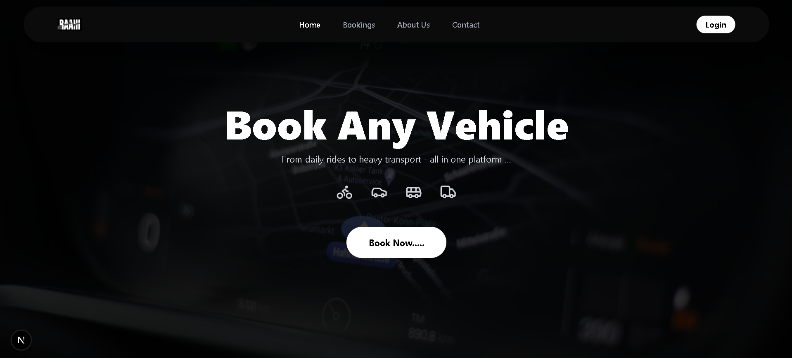

# 🚗 RAAHI - Premium Vehicle Booking

<div align="center">
  
</div>

<br />

RAAHI is a premium vehicle booking platform that offers a seamless and luxurious experience for booking everything from daily rides to heavy transport, all from one comprehensive application. Built with modern web technologies, RAAHI provides a visually stunning, dark-themed interface.

---

## ✨ Features

- 🎨 **Premium UI/UX:** Stunning dark mode interface with smooth micro-interactions and animations powered by Motion.
- 🚙 **Versatile Booking Options:** Book anything from bikes and cars to buses and heavy transport trucks.
- 🔐 **Secure Authentication:** Robust user authentication using Next-Auth, JSON Web Tokens (JWT), and bcryptjs.
- 📧 **Email Integration:** Automated transactional emails powered by Nodemailer.
- 🗄️ **Database Integration:** Reliable data storage and retrieval using MongoDB and Mongoose.
- 📱 **Fully Responsive:** Designed with modern Tailwind CSS to look exceptional on all devices.

---

## 📸 Screenshots

### Landing Page


### Login / Authentication
 

---

## 🛠️ Tech Stack

### Frontend
- **Framework:** Next.js (App Router)
- **Library:** React
- **Styling:** Tailwind CSS v4
- **Animations:** Motion (Framer Motion)
- **Icons:** Lucide React

### Backend
- **Framework:** Next.js API Routes (Node.js)
- **Database:** MongoDB & Mongoose
- **Authentication:** Next-Auth (v5), JWT, bcryptjs
- **Email:** Nodemailer
- **HTTP Client:** Axios

---

## ⚙️ Installation & Setup

### Prerequisites
- Node.js (v20+ recommended)
- MongoDB instance (local or Atlas)

### 1. Clone the repository
```bash
git clone https://github.com/AkashGautam-27/Raahi.git
cd Raahi
```

### 2. Navigate to the client directory
```bash
cd client
```

### 3. Install dependencies
```bash
npm install
```

### 4. Environment Variables
Create a `.env` file in the `client` directory and add your required variables:
```env
MONGODB_URI=your_mongodb_connection_string
NEXTAUTH_SECRET=your_nextauth_secret
# Add other relevant keys like Google OAuth credentials if used
```

### 5. Run the development server
```bash
npm run dev
```

Open [http://localhost:3000](http://localhost:3000) with your browser to see the result.

---

## 🤝 Contributing

Contributions, issues, and feature requests are welcome!

## 📝 License

This project is licensed under the MIT License.
