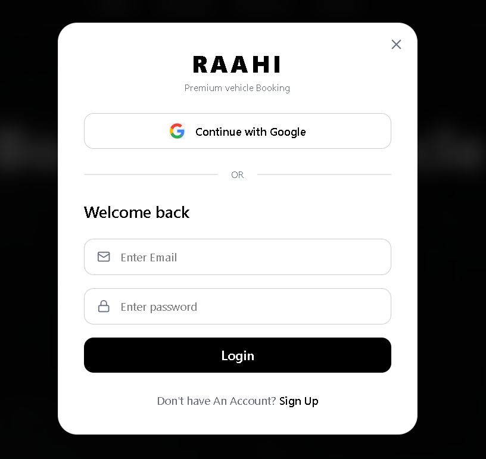

# RAAHI - Premium Vehicle Booking


RAAHI is a premium vehicle booking platform that offers a seamless and luxurious experience for booking daily rides to heavy transport, all from one comprehensive application. Built with modern web technologies, RAAHI provides a dark-themed, visually stunning interface.

## 🚀 Features

- **Premium UI/UX:** Stunning dark mode interface with smooth animations powered by Framer Motion.
- **Versatile Booking Options:** Book anything from bikes and cars to buses and heavy transport trucks.
- **Secure Authentication:** Robust user authentication using Next-Auth, JSON Web Tokens (JWT), and bcrypt.
- **Database Integration:** Reliable data storage and retrieval using MongoDB and Mongoose.
- **Fully Responsive:** Designed with Tailwind CSS to look great on all devices.

## 📸 Screenshots

### Landing Page


### Login / Authentication
 


## 🛠️ Tech Stack

- **Frontend:** Next.js (App Router), React, Tailwind CSS, Framer Motion, Lucide React
- **Backend:** Next.js API Routes, Node.js
- **Database:** MongoDB, Mongoose
- **Authentication:** Next-Auth, JWT, bcryptjs
- **HTTP Client:** Axios

## ⚙️ Installation & Setup

1. **Clone the repository**
   ```bash
   git clone https://github.com/AkashGautam-27/Raahi.git
   cd Raahi
   ```

2. **Navigate to the client directory**
   ```bash
   cd client
   ```

3. **Install dependencies**
   ```bash
   npm install
   ```

4. **Environment Variables**
   Create a `.env` file in the `client` directory and add your required variables:
   ```env
   MONGODB_URI=your_mongodb_connection_string
   NEXTAUTH_SECRET=your_nextauth_secret
   # Add other relevant keys like Google OAuth credentials if used
   ```

5. **Run the development server**
   ```bash
   npm run dev
   ```

   Open [http://localhost:3000](http://localhost:3000) with your browser to see the result.

## 🤝 Contributing

Contributions, issues, and feature requests are welcome!

## 📝 License

This project is licensed under the MIT License.
